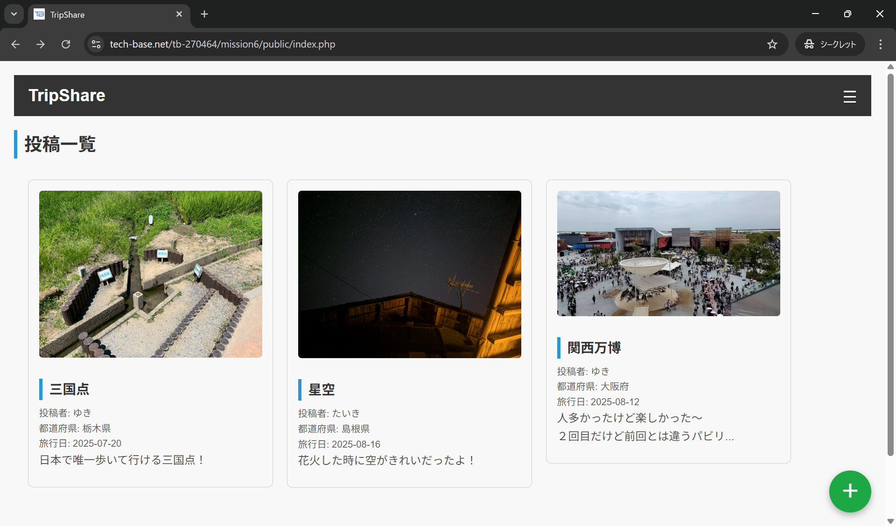
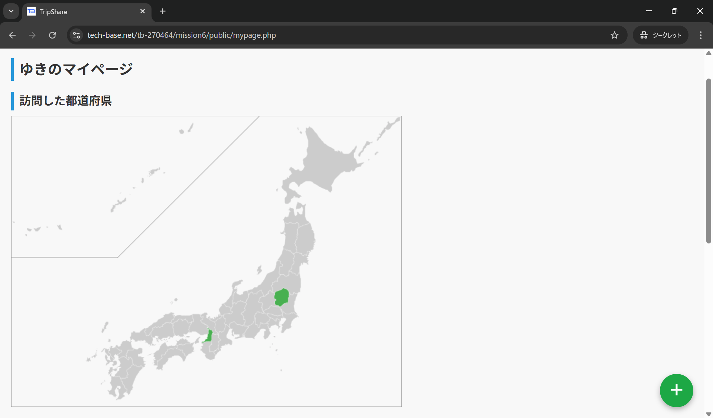
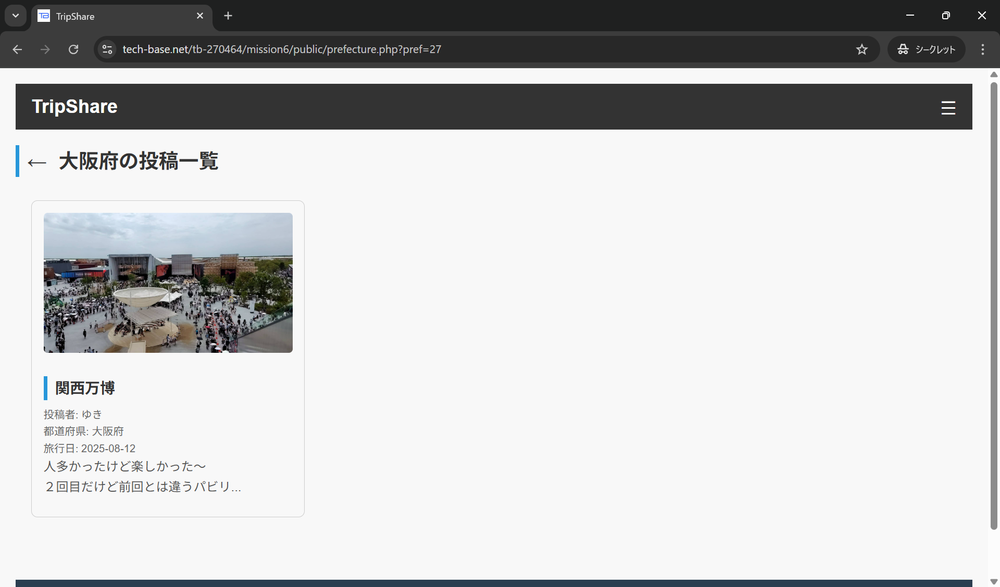

# TripShare
このリポジトリは，[TECH-BASE プログラミングインターンシップ](https://tech-base.net/)で作成したアプリケーションのリポジトリです．
インターンシップ先のサーバを使用していたため、現在はアクセスできません．
## 概要
TripShareは，ユーザーが旅行記を投稿・共有し，訪問都道府県の達成度を可視化できるWebアプリケーションです．  
旅行好きのユーザーが自分の旅行体験を記録・公開したり，他ユーザーの旅行記を参考に旅行計画を立てたりできます．  
詳細は[こちら](https://github.com/yuki-00221/trip-share/blob/main/docs/proposal.md)．

